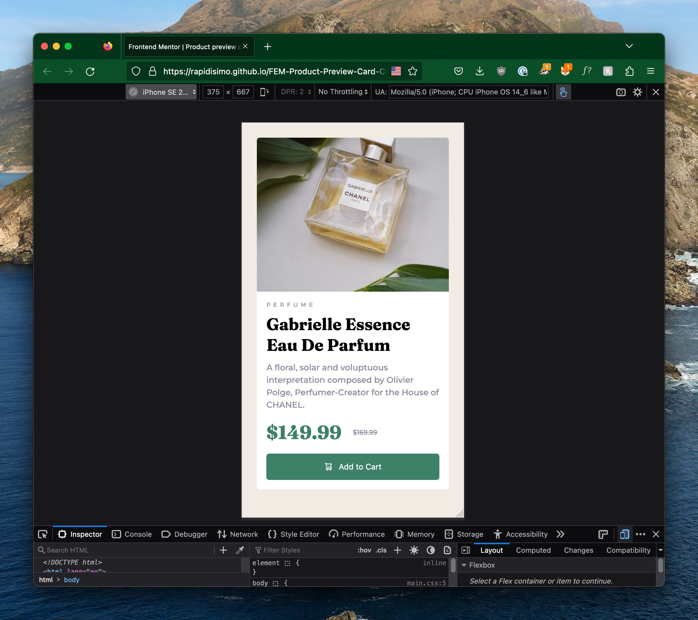

# Frontend Mentor - Product preview card component solution

This is a solution to the [Product preview card component challenge on Frontend Mentor](https://www.frontendmentor.io/challenges/product-preview-card-component-GO7UmttRfa).

## Table of contents

- [Overview](#overview)
  - [The challenge](#the-challenge)
  - [Screenshot](#screenshot)
  - [Links](#links)
- [My process](#my-process)
  - [Built with](#built-with)
  - [What I learned](#what-i-learned)
  - [Continued development](#continued-development)
- [Author](#author)

## Overview

### The challenge

Users should be able to:

- Build to de design spec
- See hover states for interactive elements

### Screenshot

### Links

- Solution URL: [FEM Solution Page](https://www.frontendmentor.io/solutions/product-preview-card-component-RCEvQ2c-8h)
- Live Site URL: [Add live site URL here](https://rapidisimo.github.io/FEM-Product-Preview-Card-Component/)

## My process
This was my second time using FrontEnd Mentor I decided to use the downloadable JPG version (tiny previews). My objective was to get as close to the design as possible using basic HTML and CSS.

### Built with

- Semantic HTML5 markup
- CSS custom properties
- CSS Grid
- Mobile-first workflow

### What I learned

The more you practice the faster you get!

### Continued development

I'd like to tackle bigger projects!

## Author

- Website - [Josue Rodriguez](https://www.josue.me)
- Frontend Mentor - [@Rapidisimo](https://www.frontendmentor.io/profile/Rapidisimo)
- Twitter - [@AnotherDK](https://www.twitter.com/AnotherDK)

